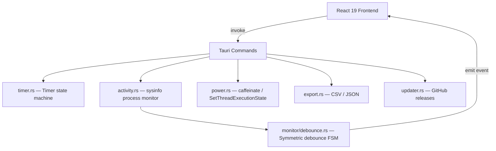

# smart-time-tracker

> Cross-platform desktop time tracker with smart idle detection — built with Tauri 2 + Rust 2024 + React 19

[](https://github.com/lanz-2024/smart-time-tracker/actions)
[](LICENSE)

## Why Tauri 2 over Electron

| | Tauri 2 | Electron |
|---|---|---|
| Bundle size | ~5MB | ~150MB |
| Memory | ~30MB | ~150MB+ |
| Backend | Rust (safe, fast) | Node.js |
| Security | Capability-based permissions | Chromium sandbox |

## Architecture



## Quick Start

```bash
# Prerequisites: Rust toolchain + Node 22 + pnpm
git clone https://github.com/lanz-2024/smart-time-tracker
cd smart-time-tracker
pnpm install
pnpm tauri dev        # starts desktop app with HMR
```

## Tech Stack

| Layer | Technology | Version |
|-------|-----------|---------|
| Framework | Tauri | 2.10 |
| Backend | Rust | 2024 edition |
| Frontend | React | 19.2 |
| Language | TypeScript | 6.0 strict |
| Styling | Tailwind CSS | v4 |
| State | Zustand + tauri-plugin-store | 5.0 |
| Activity | sysinfo | 0.30 |
| Testing | Vitest (frontend) + cargo test (Rust) | 4.1 |
| Linting | Biome (TS) + clippy (Rust) | 2.3 |

## Features

- **Timer** — start / stop / pause with elapsed time display
- **Smart idle detection** — dual-signal: keyboard/mouse + process CPU via `sysinfo`
- **Symmetric debounce FSM** — 3 active readings → active; 6 idle → idle (configurable)
- **Auto-pause on sustained idle** — configurable threshold
- **Screensaver prevention** — `caffeinate -di` on macOS while timer runs
- **Project & task management** — local, no account required
- **Offline-first** — all data stored locally via `tauri-plugin-store`
- **Export** — CSV / JSON time entries
- **System tray** — minimize to tray, quit
- **Auto-update checker** — polls GitHub releases API
- **Global keyboard shortcut** — start/stop from anywhere

## Project Structure

```
src/                        # React frontend
├── components/             # TrackerCard, ProjectList, TimeLog, Settings
├── hooks/                  # use-timer, use-activity-monitor, use-projects
└── types/index.ts

src-tauri/                  # Rust backend
├── src/
│   ├── commands/           # timer, activity, power, export, updater
│   ├── monitor/            # process_detector, debounce FSM
│   └── store/              # projects, time_entries
├── Cargo.toml
└── tauri.conf.json
```

## Rust Backend

The Rust backend exposes typed Tauri commands to the frontend:

```rust
// Activity detection via sysinfo
#[tauri::command]
pub fn get_activity_state() -> ActivityState { ... }

// Symmetric debounce — prevents flapping
pub struct ActivityDebouncer {
    active_threshold: u32,  // 3 readings to confirm active
    idle_threshold: u32,    // 6 readings to confirm idle
}
```

## Testing

```bash
pnpm test           # Vitest frontend tests
pnpm test:ci        # Headless + coverage
cargo test          # Rust unit tests (debounce FSM, timer, export)
cargo clippy        # Rust linting
```

## Build Targets

| Platform | Target | Output |
|----------|--------|--------|
| macOS ARM | aarch64-apple-darwin | .dmg + .app |
| macOS Intel | x86_64-apple-darwin | .dmg + .app |
| Windows | x86_64-pc-windows-msvc | .msi + .exe |

```bash
pnpm tauri build    # builds for current platform
```

## CI/CD

GitHub Actions matrix builds on push to `main`:
- macOS ARM + Intel, Windows x64
- Rust: clippy + fmt + test
- TypeScript: lint + typecheck + test

## License

MIT © 2026 Lan
